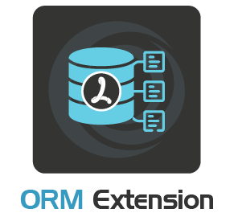

# Introduction

## BoxLang ORM

<figure><figcaption></figcaption></figure>

The [BoxLang ORM module](https://www.ortussolutions.com/products/orm-extension) allows your BoxLang
  application to integrate with the powerful [Hibernate ORM](https://hibernate.org/orm/). With Hibernate, you can interact with your database records in an object oriented fashion, using components to denote each record and simple getters and setters for each field value:

```js
component entityName="Auto" persistent="true" {

	property name="id" type="string" fieldtype="id" ormtype="string";
	property name="make" type="string";
	property name="model" type="string";

    function onPreInsert(){
        log.info( "Inserting new Auto: #getMake()# #getModel()#" );
    }
}
```

BoxLang ORM also enables transactional persistence, where an error during a save will roll back the entire transaction to prevent leaving the database in a broken state:

```js
transaction{
    try{
        entitySave(
            entityNew( "Purchase", {
                productID : "123-expensive-watch",
                purchaseTime : now(),
                customerID : customer.getId()
            })
        );
        var cartProducts = entityLoad( "CartProduct", customer.getID() );
        entityDelete( cartProducts );
    } catch ( any e ){
        // don't clear the user's cart if the purchase failed
        transactionRollback();
        rethrow;
    }
}
```

### Hibernate Version Support

#### Extension v6.2+

The Ortus ORM Extension bundles Hibernate `5.6.15.FINAL`.

### Open Source Product

The Ortus ORM extension is an open source BoxLang module with no license purchase necessary. If you are looking to further the development of this extension, consider [sponsoring a feature or opening a support contract](./#support).

### Features In A Nutshell

* Add Object Relational Mapping to any boxlang app with Hibernate ORM
* Use native built-in-functions (BIFs) to update and persist entities to the database (`entityNew()`, `entitySave()`, `ormFlush()`, etc.)
* Supports 80+ database dialects, from `SQLServer2005` to `MySQL8` and `PostgreSQL`
* Generate your mapping XML once and never again with the `autoGenMap=false` ORM configuration setting
* React to entity changes with pre and post event listeners such as `onPreInsert()`, `onPreUpdate()` and `onPreDelete()`
* Over 20 native BIFs:
  * `EntityDelete()`
  * `EntityLoad()`
  * `EntityLoadByExample()`
  * `EntityLoadByPK()`
  * `EntityMerge()`
  * `EntityNameArray()`
  * `EntityNameList()`
  * `EntityNew()`
  * `EntityReload()`
  * `EntitySave()`
  * `EntityToQuery()`
  * `ORMClearSession()`
  * `ORMCloseAllSessions()`
  * `ORMEvictCollection()`
  * `ORMEvictEntity()`
  * `ORMEvictQueries()`
  * `ORMExecuteQuery()`
  * `ORMFlush()`
  * `ORMGetSession()`
  * `ORMGetSessionFactory()`
  * `ORMReload()`

### Support

Our expertise with Hibernate ORM and Lucee Server allows us to give back to the community, as well as offer premium support to enterprises looking for a level up in their Hibernate implementations. If you need performance optimization, session management or caching integrations, please [contact us for support](https://ortussolutions.atlassian.net/servicedesk/customer/portal/9).

* Source Code: [https://github.com/Ortus-Solutions/extension-hibernate](https://github.com/Ortus-Solutions/extension-hibernate)
* Support Plans: [https://www.ortussolutions.com/services/support](https://www.ortussolutions.com/services/support)
* Bug Tracker: [https://ortussolutions.atlassian.net/browse/OOE](https://ortussolutions.atlassian.net/browse/OOE)
