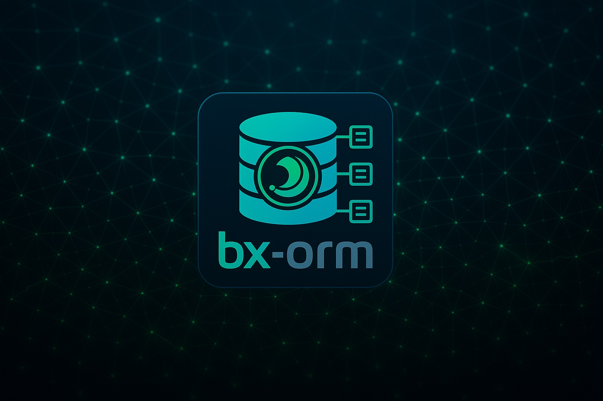

# Introduction

## BoxLang ORM

<figure><figcaption></figcaption></figure>

The [BoxLang ORM module](https://github.com/ortus-boxlang/bx-orm) allows your BoxLang\
application to integrate with the powerful [Hibernate ORM](https://hibernate.org/orm/). With Hibernate, you can interact with your database records in an object oriented fashion, using a BoxLang class to denote each record and simple getters and setters for each field value:

```js
class entityName="Auto" persistent="true" {

	property name="id" type="string" fieldtype="id" ormtype="string";
	property name="make" type="string";
	property name="model" type="string";

    function preInsert( entity ){
        writeLog( "Inserting new Auto: #getMake()# #getModel()#" );
    }
}
```

BoxLang ORM also enables transactional persistence, where an error during a save will roll back the entire transaction to prevent leaving the database in a broken state:

```js
transaction{
    try{
        entitySave(
            entityNew( "Purchase", {
                productID : "123-expensive-watch",
                purchaseTime : now(),
                customerID : customer.getId()
            })
        );
        var cartProducts = entityLoad( "CartProduct", customer.getID() );
        entityDelete( cartProducts );
    } catch ( any e ){
        // don't clear the user's cart if the purchase failed
        transactionRollback();
        rethrow;
    }
}
```

### Hibernate Version Support

bx-orm bundles Hibernate ORM `7.4.8.Final`.

### Open Source Product

bx-orm is an open source BoxLang module with no license purchase necessary. If you are looking to further the development of this extension, consider [sponsoring a feature or opening a support contract](./#support).

### Features In A Nutshell

* Map BoxLang classes to database tables and work with rows as objects, with generated getters and setters.
* 47 built-in functions (BIFs) to create, load, save, delete, query and inspect entities (`entityNew()`, `entitySave()`, `entityLoad()`, `ormExecuteQuery()`, ...).
* A fluent query builder, `entityCriteria()`, with automatic joins, projections, paging and bulk statements.
* Entities as structs for JSON APIs with `entityToStruct()`, compatible with mementifier's `this.memento`.
* Entities as queries for reports, grids and exports with `entityToQuery()`. See [Entities as Queries](usage/queries.md).
* ORM work shares BoxLang's `transaction{}`, so ORM writes and plain SQL commit or roll back together.
* Soft delete, automatic timestamps, pessimistic locking, read-only loads and a second-level cache.
* Entity events (`preInsert()`, `postUpdate()`, `postCommit()`, ...) with the power to veto a write.
* Clear `orm.*` errors that name your entities and say how to fix the problem, plus `ormDiagnostics()`.
* A boot cache that lets production start without parsing a single entity.
* Supports every database Hibernate supports, from MySQL, MariaDB and PostgreSQL to SQL Server, Oracle and SQLite.


New to bx-orm? Start with the [Quick Start](getting-started/quick-start.md). Upgrading from 1.x? Read [What's New in 2.0.0](release-history/whats-new-2.0.0.md) and [Upgrading to 2.0.0](release-history/upgrading-to-2.0.0.md).


### Support

By launching [BoxLang](https://boxlang.io/) we are able to give back to the community, as well as offer premium support to enterprises looking for a level up in their Hibernate implementations. If you need performance optimization, session management or caching integrations, please [contact us for support](https://ortussolutions.atlassian.net/servicedesk/customer/portal/9).

* Source Code: [github.com/ortus-boxlang/bx-orm](https://github.com/ortus-boxlang/bx-orm)
* Support Plans: [https://www.ortussolutions.com/services/support](https://www.ortussolutions.com/services/support)
* Bug Tracker: [https://ortussolutions.atlassian.net/browse/BLMODULES](https://ortussolutions.atlassian.net/browse/BLMODULES)
