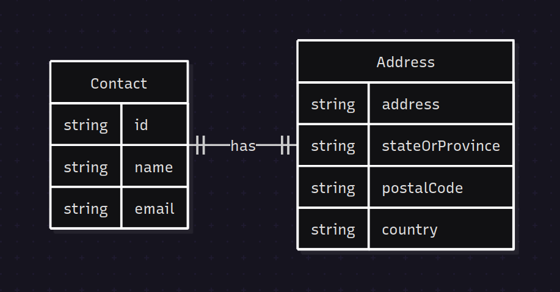
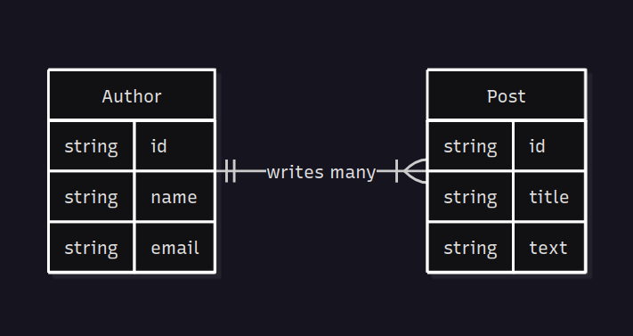
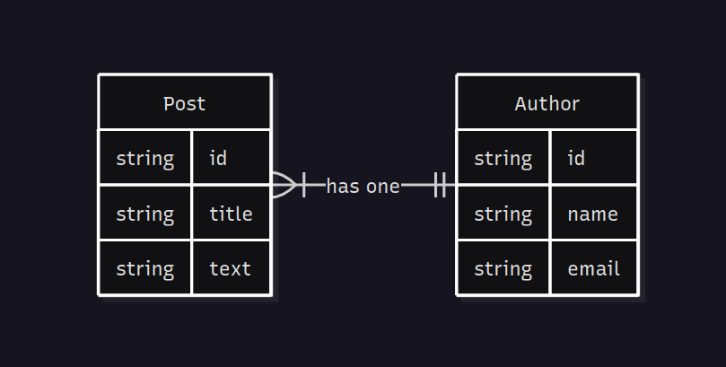
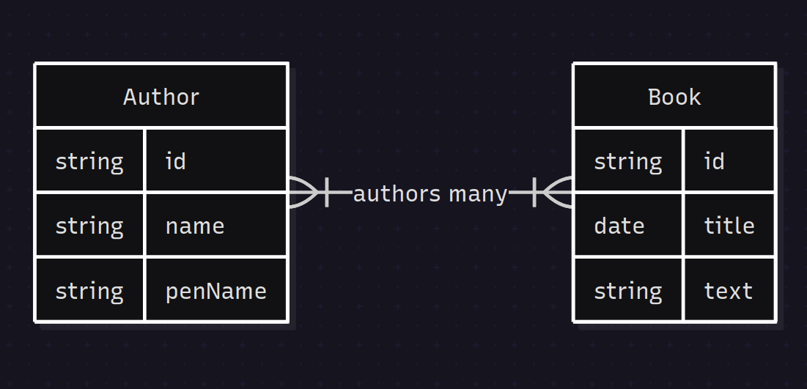

# Modeling Relationships

Every relationship property must define the state of the relationship. In each case, the relationship property is defined in an entity which represents the "left" side of the relationship. If you bring a `Posts` relationship into the `User` entity, then from the `User` entity, the `User` is the left side of the relationship, and `Posts` is the right.

## One To One

A one to one relationship couples a single row on the left side to a single row on the right side:

```js
property name      = "Address"
         fieldtype = "one-to-one"
         class     = "Address";
```

One to one relationships can be seen as simply extending the entity with additional information. Since there is no possibility of multiple records per entity instance, it may be worthwhile to set `lazy=false` to fetch the related entity along with any entity load:

```js
property name      = "Address"
         fieldtype = "one-to-one"
         class     = "Address"
         lazy      = "false";
```

This one-to-one relationship can be visualized as follows:



### Constrained (`constrained`)

The `constrained` attribute is specific to `one-to-one` relationships. When set to `true`, it declares that the owning entity's primary key has a foreign-key constraint pointing to the associated entity's primary key — in other words, the associated record must exist:

```js
property name        = "userProfile"
         fieldtype   = "one-to-one"
         class       = "UserProfile"
         constrained = "true";
```

Use `constrained=true` when the `UserProfile` table's primary key is also a foreign key back to the `User` table (a shared-primary-key one-to-one). Without it, Hibernate treats the association as a simple reference with no FK constraint generated in the schema.

## One To Many

A one to many relationship couples a single row on the left side (the "one") to multiple rows on the right side (the "many"):

```js
class entityName="User" persistent="true"{
    property name      = "posts"
             fieldtype = "one-to-many"
             class     = "Post"
             fkcolumn  = "author_id";
}
```

You'll normally want to set `lazy="true"` to (for example) avoid fetching every Post on a User:

```js
property name      = "posts"
         fieldtype = "one-to-many"
         class     = "Post"
         lazy      = "true"
         fkcolumn  = "author_id";
```



## Many To One

A many to one relationship couples multiple rows on the left side (the "many") to a single row on the right side( the "one"):

```js
property name      = "Authors"
         fieldtype = "many-to-one"
         class     = "User"
         fkcolumn  = "author_id";
```

Thus, a single Post can have only one Author... but an Author (or a User, really) can have many Posts.



## Many To Many

A many to many relationship allows each entity to relate to multiple rows on the opposite side. A good example might be the author/book relationship. Each book can have multiple authors, and each author may write multiple books:

```js
// Author.bx
property name      = "books"
         fieldtype = "many-to-many"
         class     = "Book"
         linktable = "author_books_link";
```

The `linktable` attribute is required on a `many-to-many` property to set the location for storing join records. You can further alter the storage location via `linkschema` and `linkcatalog`:

```js
property name        = "authors"
         fieldtype   = "many-to-many"
         class       = "Author";
         linkschema  = "blog"
         linkcatalog = "dbo";
```



### Singular Name

On many\* relationships like `one-to-many`, `many-to-one`, etc., you'll be manipulating the full set of items via the property name: `hasAuthors()`, `setAuthors()`, etc. However, this plural terminology becomes weird when used on a single item addition or removal, such as `addAuthors( Author )`. For this reason, you can define a `singularName=STRING` attribute to clean up your entity manipulation:

```js
property name         = "Authors"
         singularName = "Author"
         fieldtype    = "many-to-one"
         class        = "User";
```

### Lazy Loading

The `lazy` attribute controls **when** Hibernate fetches the related data — immediately when the owning entity is loaded, or deferred until the data is actually accessed. Choosing the right strategy can have a significant impact on performance.

| Value | Applies to | Behaviour |
|-------|-----------|-----------|
| `false` | all | Related data is fetched immediately in the same SQL query (eager loading). |
| `true` | all | Related data is fetched lazily; Hibernate issues a separate SQL query only when the association is first accessed. |
| `proxy` | to-one (`many-to-one`, `one-to-one`) | Like `true`, but the related entity is replaced with a lightweight proxy object. The real entity is loaded only when a non-identifier getter is called. |
| `extra` | to-many (`one-to-many`, `many-to-many`) | Like `true`, but even more granular — aggregate operations (`size()`, `contains()`, etc.) are resolved without loading the full collection. |

#### `lazy=false` — Eager Loading

Eager loading fetches the association in the same query as the parent entity. This is most useful for to-one relationships where the related data is almost always needed:

```js
property name      = "Address"
         fieldtype = "one-to-one"
         class     = "Address"
         lazy      = "false";
```

Avoid using `lazy=false` on to-many collections — fetching large collections eagerly can significantly inflate query result sets.

#### `lazy=true` — Lazy Loading

Related data is not fetched until you first access it. A separate SQL query is issued at that point:

```js
property name      = "posts"
         fieldtype = "one-to-many"
         class     = "Post"
         lazy      = "true"
         fkcolumn  = "author_id";
```

For to-one relationships, `lazy=true` behaves identically to `lazy=proxy` when the application-level `proxyLazyLoading` setting is enabled (see below).

#### `lazy=proxy` — Proxy-Based Lazy Loading

Only valid on to-one relationships (`many-to-one`, `one-to-one`). Hibernate returns a proxy object in place of the real entity. The proxy holds the primary key so that identity checks work without hitting the database; the real entity is loaded only when you call a non-identifier getter:

```js
property name      = "manufacturer"
         fieldtype = "many-to-one"
         class     = "Manufacturer"
         fkcolumn  = "FK_manufacturer"
         lazy      = "proxy";
```

This is the most efficient lazy strategy for to-one associations. When the `proxyLazyLoading` application setting is `true`, BoxLang ORM automatically upgrades `lazy=true` to `lazy=proxy` for all to-one properties (see below).

#### `lazy=extra` — Extra Lazy Collection Loading

A more granular form of lazy loading for to-many collections. Aggregate operations on the collection (checking `size()`, calling `contains()`, etc.) are resolved with targeted SQL without loading the full collection into memory:

```js
property name      = "posts"
         fieldtype = "one-to-many"
         class     = "Post"
         lazy      = "extra"
         fkcolumn  = "author_id";
```

Use `lazy=extra` when you frequently need collection metadata (e.g. counts) but rarely iterate over the full set.

#### `proxyLazyLoading` Application Setting

The `proxyLazyLoading` boolean in your `Application.bx` ORM settings controls whether `lazy=true` is automatically promoted to `lazy=proxy` for **to-one** relationships at mapping time.

| Setting | Default |
|---------|---------|
| `proxyLazyLoading = false` | `lazy=true` on a to-one stays as Hibernate `lazy=true` (standard lazy fetch) |
| `proxyLazyLoading = true` | `lazy=true` on a to-one is rewritten to `lazy=proxy` (proxy-based lazy fetch) |

```js
// Application.bx
this.ormSettings = {
    proxyLazyLoading : true
};
```

> **Note:** `proxyLazyLoading` defaults to `false` in BoxLang ORM to match Adobe ColdFusion and Lucee behaviors. If you are migrating from ACF or Lucee and rely on proxy-based lazy loading, you must explicitly set `proxyLazyLoading = true`, or install `bx-compat-cfml` which restores the legacy default.

### Cascade

The `cascade` attribute controls which persistence operations performed on the owning entity are automatically propagated to the associated entity or collection. Without a cascade setting, you must explicitly save, delete, or update each related entity yourself.

| Value | Behaviour |
|-------|-----------|
| `none` | No operations are cascaded. Each entity must be persisted independently. (Default) |
| `all` | All operations below are cascaded. |
| `save-update` | `EntitySave()` on the owner also saves or updates the related entity. |
| `persist` | JPA-style alias for `save-update`. |
| `merge` | Merging the owner into the session also merges the related entity. |
| `delete` | Deleting the owner also deletes the related entity. |
| `remove` | JPA-style alias for `delete`. |
| `refresh` | Refreshing the owner from the database also refreshes the related entity. |
| `evict` | Evicting the owner from the session cache also evicts the related entity. |
| `lock` | Locking the owner into the session also locks the related entity. |
| `replicate` | Replicating the owner also replicates the related entity. |

You can combine multiple values as a comma-separated string:

```js
property name      = "posts"
         fieldtype = "one-to-many"
         class     = "Post"
         fkcolumn  = "author_id"
         cascade   = "save-update,delete";
```

With `cascade="save-update,delete"`, calling `EntitySave( user )` will automatically persist any new or modified `Post` objects in the collection, and calling `EntityDelete( user )` will delete all of the user's posts first.

> **Warning:** Use `cascade="all"` or `cascade="delete"` carefully on large collections. Deleting a `User` with thousands of posts will issue a DELETE for each one individually unless you configure bulk operations at the database level.

### Fetch Strategy

The `fetch` attribute controls *how* Hibernate retrieves the association when it does load — as a SQL JOIN in the same query, or as a separate SELECT:

| Value | Behaviour |
|-------|-----------|
| `select` | Hibernate issues a separate SELECT query to load the association. (Default) |
| `join` | Hibernate uses a SQL JOIN to load the association in the same query as the parent. |

```js
property name      = "manufacturer"
         fieldtype = "many-to-one"
         class     = "Manufacturer"
         fkcolumn  = "FK_manufacturer"
         fetch     = "join";
```

`fetch=join` forces eager loading regardless of the `lazy` setting and is most useful on to-one associations where the related data is almost always needed. Avoid it on to-many collections, as it can multiply the result-set rows.

### Ordering Collections (`orderBy`)

The `orderBy` attribute applies a SQL `ORDER BY` clause whenever Hibernate loads a to-many collection. The value is a raw SQL fragment:

```js
property name      = "posts"
         fieldtype = "one-to-many"
         class     = "Post"
         fkcolumn  = "author_id"
         orderBy   = "created_at DESC";
```

The collection returned from `getPosts()` will always be sorted by `created_at` descending. This is applied at the database level, not in memory.

### Filtering Collections (`where`)

The `where` attribute applies a fixed SQL `WHERE` condition to a collection, restricting which rows are ever included. The value is a raw SQL fragment (not HQL):

```js
property name      = "publishedPosts"
         fieldtype = "one-to-many"
         class     = "Post"
         fkcolumn  = "author_id"
         where     = "status = 'published'";
```

`getPosts()` will only ever return rows where `status = 'published'`. This is useful for modelling a filtered view of a collection without a separate entity query.

### Inverse and Bidirectional Relationships

When you model a relationship from both sides (e.g. `User` has `posts` and `Post` has `author`), only one side should "own" the foreign key and be responsible for writing it to the database. The other side is the **inverse** side and should be marked accordingly to avoid Hibernate attempting to update the join column twice.

Use `inverse=true` to mark a collection as the non-owning side:

```js
// User.bx — inverse side
property name      = "posts"
         fieldtype = "one-to-many"
         class     = "Post"
         fkcolumn  = "author_id"
         inverse   = "true";

// Post.bx — owning side (holds the FK column)
property name      = "author"
         fieldtype = "many-to-one"
         class     = "User"
         fkcolumn  = "author_id";
```

Alternatively, use `mappedBy` on the collection to name the property on the child entity that owns the join:

```js
// User.bx
property name      = "posts"
         fieldtype = "one-to-many"
         class     = "Post"
         mappedBy  = "author";
```

Both `inverse=true` and `mappedBy` tell Hibernate the same thing: this collection side does not manage the foreign key. For `one-to-many` / `many-to-one` pairs, always mark the collection side as inverse (or use `mappedBy`). For `many-to-many`, pick one side.

### Batch Size (`batchsize`)

The `batchsize` attribute overrides the global `defaultBatchSize` ORM setting for this specific collection, controlling how many collections Hibernate fetches in a single round-trip when multiple parent entities are loaded:

```js
property name      = "posts"
         fieldtype = "one-to-many"
         class     = "Post"
         fkcolumn  = "author_id"
         lazy      = "true"
         batchsize = "50";
```

If you load 100 `User` entities and then access each one's `posts`, Hibernate will fetch them in batches of 50 rather than issuing 100 individual SELECT queries.

When no per-property `batchsize` is set, Hibernate falls back to the application-wide `defaultBatchSize` ORM setting (see [Configuration](../intro/configuration.md)). BoxLang ORM defaults `defaultBatchSize` to `25`, while Adobe ColdFusion and Lucee both historically default to `16`. If you are migrating from ACF/Lucee and want matching batch-fetch behavior, set `defaultBatchSize=16` in your `this.ormSettings`, or install `bx-compat-cfml` which restores the legacy default.

## Relationship Methods

When you define a relationship property, a number of methods are automatically generated in each relationship entity instance which allow you to access and manipulate the relationship data.

| Method | Description | Relationship types |
|--------|-------------|-------|
| `has<PropertyName>()` | Returns true if the relationship contains any items. | All |
| `add<PropertyName>( entity1 )` | Add an entity instance to the relationship. | `one-to-many`, `many-to-many` |
| `remove<PropertyName>( entity1 )` | Removes one or more entities from the relationship. | `one-to-many`, `many-to-many` |

These method signatures are as follows:

```java
public boolean function hasPosts();
// returns `this` for method chaining
public component function addPosts( required any postItem );
// returns `this` for method chaining
public component function removePosts( required any postItem );
```

### One-To-One Example

The following relationship definition defines a `Contact` property on a `User` entity:

```java
property name="Contact"
    fieldtype="one-to-one"
    class="Contact";
```
Since this is a one-to-one relationship, *only the `hasContact()` method is generated*:

* `hasContact()`

Use the property accessor methods `getContact()` and `setContact()` to access and modify the relationship.

### One-To-Many Example

The following relationship definition defines a `posts` property on a `User` entity:

```java
property name="posts"
    fieldtype="one-to-many"
    class="Post"
    lazy="true";
```

Since this is a one-to-many relationship, the following methods are generated:

* `hasPosts()`
* `addPosts()`
* `removePosts()`

### Singular Name

We can set a `singularName` attribute to change the `addPosts()` and `removePosts()` methods to `addPost()` and `removePost()`:

```java
property name="posts"
    singularName="post"
    fieldtype="one-to-many"
    class="Post"
    lazy="true";
```

This will generate the following methods:

* `hasPosts()`
* `addPost()`
* `removePost()`

Note that the `hasPosts()` method remains plural since it checks for the existence of any posts in the relationship.