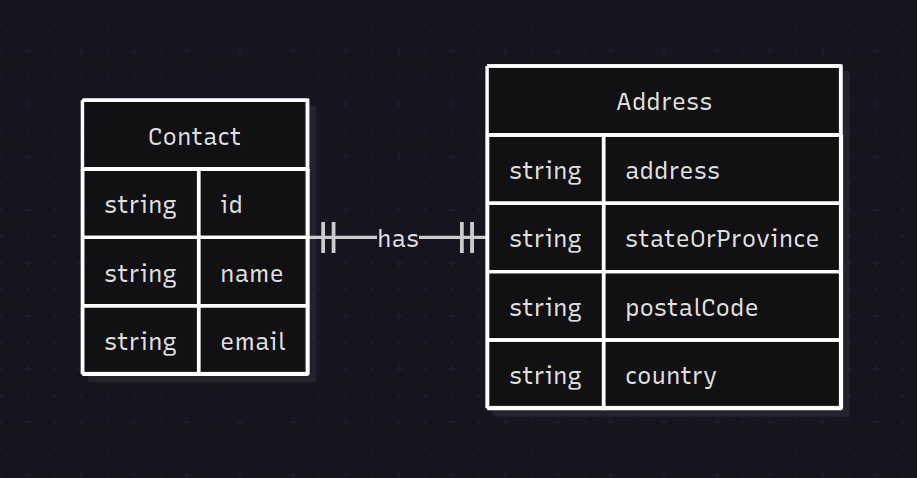
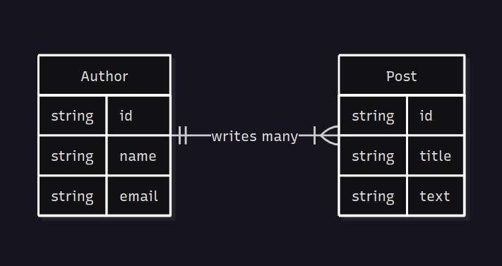
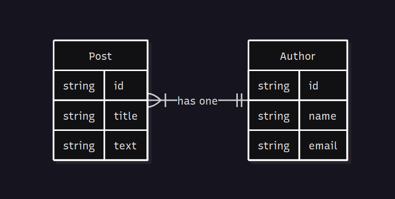
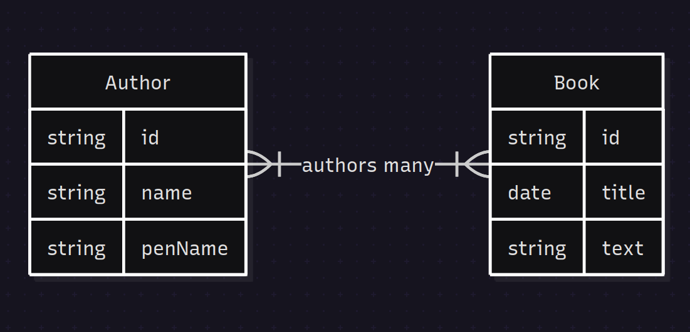

# Relationships

Every relationship property must define the state of the relationship. In each case, the relationship property is defined in an entity which represents the "left" side of the relationship. If you bring a `Posts` relationship into the `User` entity, then from the `User` entity, the `User` is the left side of the relationship, and `Posts` is the right.

## One To One

A one to one relationship couples a single row on the left side to a single row on the right side:

```js
property name="Address"
    fieldtype="one-to-one"
    class="Address";
```

One to one relationships can be seen as simply extending the entity with additional information. Since there is no possibility of multiple records per entity instance, it may be worthwhile to set `lazy=false` to fetch the related entity along with any entity load:

```js
property name="Address"
    fieldtype="one-to-one"
    class="Address"
    lazy="false";
```

This one-to-one relationship can be visualized as follows:



## One To Many

A one to many relationship couples a single row on the left side (the "one") to multiple rows on the right side (the "many"):

```js
class entityName="User" persistent="true"{
    property name="posts"
        fieldtype="one-to-many"
        class="Post"
        fkcolumn="author_id";
}
```

You'll normally want to set `lazy="true"` to (for example) avoid fetching every Post on a User:

```js
property name="posts"
    fieldtype="one-to-many"
    class="Post"
    lazy="true"
    fkcolumn="author_id";
```



## Many To One

A many to one relationship couples multiple rows on the left side (the "many") to a single row on the right side( the "one"):

```js
property name="Authors"
    fieldtype="many-to-one"
    class="User"
    fkcolumn="author_id";
```

Thus, a single Post can have only one Author... but an Author (or a User, really) can have many Posts.



## Many To Many

A many to many relationship allows each entity to relate to multiple rows on the opposite side. A good example might be the author/book relationship. Each book can have multiple authors, and each author may write multiple books:

```js
// Author.bx
property name="books"
    fieldtype="many-to-many"
    class="Book"
    linktable="author_books_link";
```

The `linktable` attribute is required on a `many-to-many` property to set the location for storing join records. You can further alter the storage location via `linkschema` and `linkcatalog`:

```js
property name="authors"
    fieldtype="many-to-many"
    class="Author";
    linkschema="blog"
    linkcatalog="dbo";
```



### Singular Name

On many\* relationships like `one-to-many`, `many-to-one`, etc., you'll be manipulating the full set of items via the property name: `hasAuthors()`, `setAuthors()`, etc. However, this plural terminology becomes weird when used on a single item addition or removal, such as `addAuthors( Author )`. For this reason, you can define a `singularName=STRING` attribute to clean up your entity manipulation:

```js
property name="Authors"
    singularName="Author"
    fieldtype="many-to-one"
    class="User";
```

### Lazy

Man, you wanna get lazy? How about don't-fetch-the-data-until-you-need-it kinda lazy?

Using `lazy=true`, we can tell Hibernate not to fetch the relational data _unless_ and _until_ a method call such as `Authors()` attempts to load it. This greatly improves performance on page requests which do not need that particular data:

```js
property name="posts"
    fieldtype="one-to-many"
    class="Post"
    lazy="true";
```

We can also use `lazy=extra` to only retrieve the rows that we touch. This may work well if we commonly only access a few rows out of the full set of child items:

```js
property name="posts"
    fieldtype="one-to-many"
    class="Post"
    lazy="extra";
```

## Relationship Methods

When you define a relationship property, a number of methods are automatically generated in each relationship entity instance which allow you to access and manipulate the relationship data.

| Method | Description | Relationship types |
|--------|-------------|-------|
| `has<PropertyName>()` | Returns true if the relationship contains any items. | All |
| `add<PropertyName>( entity1 )` | Add an entity instance to the relationship. | `one-to-many`, `many-to-many` |
| `remove<PropertyName>( entity1 )` | Removes one or more entities from the relationship. | `one-to-many`, `many-to-many` |

These method signatures are as follows:

```java
public boolean function hasPosts();
// returns `this` for method chaining
public component function addPosts( required any postItem );
// returns `this` for method chaining
public component function removePosts( required any postItem );
```

### One-To-One Example

The following relationship definition defines a `Contact` property on a `User` entity:

```java
property name="Contact"
    fieldtype="one-to-one"
    class="Contact";
```
Since this is a one-to-one relationship, *only the `hasContact()` method is generated*:

* `hasContact()`

Use the property accessor methods `getContact()` and `setContact()` to access and modify the relationship.

### One-To-Many Example

The following relationship definition defines a `posts` property on a `User` entity:

```java
property name="posts"
    fieldtype="one-to-many"
    class="Post"
    lazy="true";
```

Since this is a one-to-many relationship, the following methods are generated:

* `hasPosts()`
* `addPosts()`
* `removePosts()`

### Singular Name

We can set a `singularName` attribute to change the `addPosts()` and `removePosts()` methods to `addPost()` and `removePost()`:

```java
property name="posts"
    singularName="post"
    fieldtype="one-to-many"
    class="Post"
    lazy="true";
```

This will generate the following methods:

* `hasPosts()`
* `addPost()`
* `removePost()`

Note that the `hasPosts()` method remains plural since it checks for the existence of any posts in the relationship.