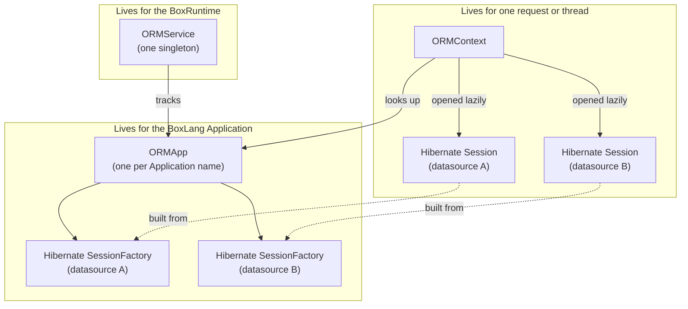

# Session Management

bx-orm manages Hibernate state across four layers. Understanding them helps explain behavior you'll run into in practice: why entities loaded in one request aren't visible in another, why a background thread needs its own session, and what actually happens when you call `ormReload()`.



## ORMService

`ORMService` is a single BoxRuntime-wide service. It keeps a map of every running `ORMApp`, keyed by the BoxLang Application's name, and is responsible for:

* Starting up an `ORMApp` the first time an ORM-enabled application runs (`startupApp()`)
* Looking up the running `ORMApp` for a given context (`getORMAppByContext()`)
* Reloading an application's ORM state (`reloadApp()`, backing the `ormReload()` BIF)
* Shutting down one application (`shutdownApp()`) or all of them when the runtime itself shuts down

## ORMApp

An `ORMApp` represents one BoxLang Application's ORM state, and is built once and reused for the life of that application (until reload or shutdown). On startup it:

1. Discovers entities via `MappingGenerator`, grouped by the datasource each entity belongs to
2. Builds one Hibernate `SessionFactory` per datasource, via `SessionFactoryBuilder`
3. Tracks which datasource is the default (from `this.ormSettings.datasource`)

Everything expensive - entity discovery, XML mapping generation, and Hibernate bootstrapping - happens here, once per application, not per request. This is why `ormSettings.entityPaths` and `generateMappings=false` matter so much for startup performance; see [Performance](performance.md).

## ORMContext and Hibernate Sessions

Where `ORMApp` is application-scoped, `ORMContext` is scoped to a single request or thread context. It holds the actual Hibernate `Session` objects your code reads and writes through, one per datasource, opened lazily the first time that datasource is touched.


Because a Hibernate `Session` is tied to a single request or thread context, spawning parallel threads (e.g. `array.each(..., true)`) gives each thread its **own** `ORMContext` and its own Hibernate sessions. An entity created with `entityNew()` inside a parallel thread is attached to that thread's session, not the request's - loading, saving, or querying it from the parent request won't see it until it's been persisted and reloaded through the request's own session.


When a session is opened, its flush mode depends on `autoManageSession`:

* `autoManageSession = false` (the default): the session is opened in `FlushMode.MANUAL`. Nothing is written to the database until you explicitly call `ormFlush()` or commit a `transaction` block. See [Transactions](transactions.md).
* `autoManageSession = true`: Hibernate manages flushing automatically (e.g. before query execution), which is generally discouraged - see the `autoManageSession` setting in [Configuration](../intro/configuration.md).

At the end of the request or thread (or explicitly via `ormCloseSession()`/`ormCloseAllSessions()`), the `ORMContext` is torn down: any active transaction on each open session is committed, then the session is closed. If `flushAtRequestEnd` and `autoManageSession` are both enabled, sessions are flushed first.

## Reloading the ORM (`ormReload()`)

Calling `ormReload()` rebuilds the current application's `ORMApp` - re-discovering entities and re-building every `SessionFactory` - without restarting the BoxLang application itself. The rebuild is ordered carefully to stay safe under concurrent requests:

1. Any open Hibernate sessions for the reloading request are closed first, so they can't hold a reference to a `SessionFactory` that's about to be replaced.
2. The new `ORMApp` (with fresh session factories) is fully built *before* it replaces the old one in the running application map.
3. The old `ORMApp` is swapped out and only then shut down, closing its old `SessionFactory` instances.

This ordering means other requests keep using a valid `ORMApp` throughout the reload, with only a small window where both the old and new session factories briefly coexist.

## Relevant Built-in Functions

| Function | Purpose |
|----------|---------|
| [ORMGetSession](../reference/built-in-functions/orm/ORMGetSession.md) | Get the raw Hibernate `Session` for the current context and datasource |
| [ORMGetSessionFactory](../reference/built-in-functions/orm/ORMGetSessionFactory.md) | Get the Hibernate `SessionFactory` for a datasource |
| [ORMFlush](../reference/built-in-functions/orm/ORMFlush.md) / [ORMFlushAll](../reference/built-in-functions/orm/ORMFlushAll.md) | Flush one or all open sessions |
| [ORMClearSession](../reference/built-in-functions/orm/ORMClearSession.md) | Detach all entities from the session without flushing |
| [EntityEvict](../reference/built-in-functions/orm/EntityEvict.md) | Detach one entity (or an array of entities) from the session without flushing |
| [ORMReadOnly](../reference/built-in-functions/orm/ORMReadOnly.md) | Run a closure with every entity it loads read-only |
| [ORMCloseSession](../reference/built-in-functions/orm/ORMCloseSession.md) / [ORMCloseAllSessions](../reference/built-in-functions/orm/ORMCloseAllSessions.md) | Close one or all open sessions for the current context |
| [ORMReload](../reference/built-in-functions/orm/ORMReload.md) | Rebuild the ORM application's session factories |
| [ORMIsSessionDirty](../reference/built-in-functions/orm/ORMIsSessionDirty.md) | Whether a flush would write something |
| [ORMGetSessionStatistics](../reference/built-in-functions/orm/ORMGetSessionStatistics.md) | Which entities and collections the session holds |

## Inspecting entities and the session

These functions answer "what is this entity, and what changed" without touching the Hibernate API. They take an entity instance (or, where it makes sense, an entity name) and never load a lazy reference just to answer.

```js
user = entityLoadByPK( "User", 1 );

entityGetName( user );             // "User"
entityGetDatasource( user );       // "app"
entityGetId( user );               // 1 (a struct for composite ids)
entityGetMetadata( "User" ).tableName; // "users"

user.setEmail( "new@example.com" );
entityIsDirty( user );             // true
entityGetDirtyProperties( user );  // [ "email" ]
ormIsSessionDirty();               // true
ormGetSessionStatistics().entityKeys; // [ "User#1" ]
```

An entity in the session is compared with the values it was loaded with, with no SQL. An entity outside the session is compared with a fresh read of its row. An entity that was never saved is not dirty.

| Function | Purpose |
| --- | --- |
| [EntityGetName](../reference/built-in-functions/orm/EntityGetName.md) | The entity name of an instance, lazy reference or name |
| [EntityGetDatasource](../reference/built-in-functions/orm/EntityGetDatasource.md) | The entity's datasource |
| [EntityGetId](../reference/built-in-functions/orm/EntityGetId.md) | The entity's id |
| [EntityGetMetadata](../reference/built-in-functions/orm/EntityGetMetadata.md) | Table, ids, properties and associations |
| [EntityIsDirty](../reference/built-in-functions/orm/EntityIsDirty.md) | Whether the entity has unsaved changes |
| [EntityGetDirtyProperties](../reference/built-in-functions/orm/EntityGetDirtyProperties.md) | Which properties changed |
